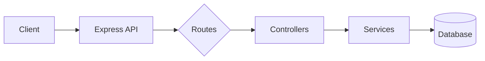
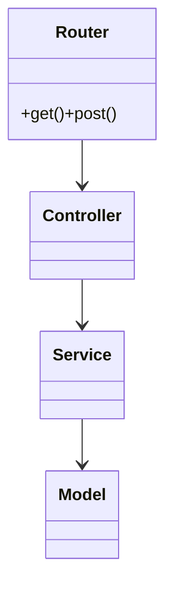

## Summary

This guide steers the AI through: (1) planning the documentation workflow, (2) analyzing the Express codebase, (3) researching Swagger/OpenAPI conventions, (4) installing and configuring Swagger tools, (5) structuring the docs folder, (6) authoring the OpenAPI spec and integrating it with Express (including request/response validation), (7) updating the README with an app overview, commands, and Mermaid diagrams, (8) automating generation and deployment to GitHub Pages via a CI workflow, and (9) setting up continuous improvement.

## 1. Planning Phase

### 1.1 Sequential Thinking

1. Create an explicit numbered plan:

   1. Analyze repo structure
   2. Research OpenAPI best practices
   3. Scaffold spec and middleware
   4. Write/validate spec
   5. Update README
   6. CI/CD for GitHub Pages
   7. Review & iterate ([Medium][1])
2. Keep this plan in memory, updating as new files or patterns emerge. ([Medium][1])

## 2. Project Analysis

### 2.1 Detect Language & Framework

* Look for `package.json` with `"express"` dependency and `import express`/`require('express')` to confirm Node.js + Express. ([DEV Community][2])
* Extract Express version (e.g. 4.x) for compatible OpenAPI tooling. ([DEV Community][2])

### 2.2 Map Folder Structure

* Enumerate top‑level directories (`routes/`, `controllers/`, `models/`, `middleware/`, `config/`) to mirror in docs. ([Medium][3])
* Note any existing YAML/JSON—plan to centralize OpenAPI spec under `/docs/openapi`. ([Medium][3])

## 3. Research Best Practices

### 3.1 OpenAPI/Swagger Conventions

* Use OpenAPI 3.0+ spec in YAML or JSON, defining `openapi`, `info`, `servers`, `paths`, `components` sections. ([Swagger][4])
* Co-locate schemas in `components.schemas` and reuse via `$ref` for DRY definitions. ([Swagger][4])

### 3.2 Serving & Validating

* Serve Swagger UI with `swagger-ui-express` middleware pointing at your spec file. ([npm][5])
* Validate requests/responses at runtime with `express-openapi-validator` against the OpenAPI spec. ([npm][6])

## 4. Setup Swagger Tools

### 4.1 Install Dependencies

```bash
npm install --save swagger-ui-express swagger-jsdoc
npm install --save-dev express-openapi-validator
```

([DEV Community][2], [npm][6])

### 4.2 Configure Swagger Middleware

Create `swagger.js`:

```js
const swaggerUi = require('swagger-ui-express');
const swaggerDocument = require('./docs/openapi.yaml');

module.exports = (app) => {
  app.use('/api-docs', swaggerUi.serve, swaggerUi.setup(swaggerDocument));
};
```

([npm][5])

Add validation middleware in `app.js` before routes:

```js
const { OpenApiValidator } = require('express-openapi-validator');
app.use(
  OpenApiValidator.middleware({
    apiSpec: './docs/openapi.yaml',
    validateRequests: true,
    validateResponses: true,
  })
);
```

([npm][6])

## 5. Design Documentation Structure

```
/docs
├─ openapi.yaml      # main OpenAPI 3 spec
├─ schemas/          # reusable component schemas
├─ examples/         # request/response examples
└─ diagrams/         # Mermaid files
```

* Keep `openapi.yaml` at project root under `/docs` for CI to pick up. ([Swagger][7])
* Store JSON schemas in `/docs/schemas` and reference via `$ref: './schemas/User.yaml'`. ([Swagger][7])

## 6. Writing Swagger Docs

### 6.1 Basic OpenAPI Header

```yaml
openapi: 3.0.3
info:
  title: My Express API
  version: 1.0.0
  description: Full Swagger/OpenAPI docs for the Express app
servers:
  - url: https://api.example.com
paths: {}
components:
  schemas: {}
```

([Swagger][4])

### 6.2 Define Paths & Operations

```yaml
paths:
  /users:
    get:
      summary: List all users
      responses:
        '200':
          description: A JSON array of user objects
          content:
            application/json:
              schema:
                type: array
                items:
                  $ref: '#/components/schemas/User'
      security:
        - bearerAuth: []
```

([npm][5])

### 6.3 Component Schemas

```yaml
components:
  schemas:
    User:
      type: object
      required: [id, name, email]
      properties:
        id:
          type: string
        name:
          type: string
        email:
          type: string
```

([Swagger][4])

### 6.4 Security Schemes

```yaml
components:
  securitySchemes:
    bearerAuth:
      type: http
      scheme: bearer
      bearerFormat: JWT
```

([Swagger][4])

### 6.5 Mermaid Architecture Diagram

In `docs/diagrams/architecture.md`:



([Swagger][4])

## 7. Automate with @web Tools

* Use `@web.search_query("Swagger OpenAPI Express best practices")` to fetch latest patterns before spec updates. ([Medium][3])
* Use `@web.open` on the official Swagger UI docs for config examples. ([Swagger][7])

## 8. Update README

### 8.1 Documentation Section

Add:

```markdown
## 📖 API Documentation

- **Swagger UI**: [https://<user>.github.io/<repo>/api-docs](https://<user>.github.io/<repo>/api-docs)
- **Generate docs**: `npm run doc:generate`
- **Validate API**: `npm start` then visit `/api-docs`
```

([Medium][1])

### 8.2 Project Overview



([Swagger][4])

### 8.3 Available Scripts

| Command                | Description                           |
| ---------------------- | ------------------------------------- |
| `npm run doc:generate` | Copy `docs/openapi.yaml` to build dir |
| `npm start`            | Start Express with Swagger UI         |
| `npm test`             | Run unit & integration tests          |
| `npm run validate`     | Validate requests/responses           |
| ([DEV Community][2])   |                                       |

